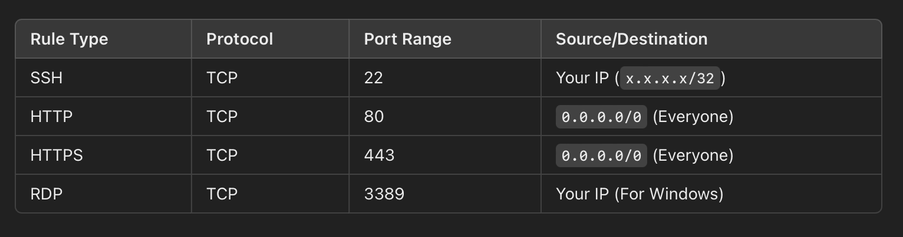

# What is a Security Group?
- A Security Group (SG) in AWS acts as a virtual firewall that controls inbound and outbound traffic for EC2 instances. 
- It operates at the instance level (not at the subnet level like NACLs).

# Key Features of Security Groups
✅ Stateful – If an inbound request is allowed, the response is automatically allowed.
✅ Allow Rules Only – No explicit deny rules (unlike NACLs).
✅ Instance-Level Security – Each EC2 instance can have multiple security groups.
✅ Default Security Group – Blocks all inbound traffic and allows outbound traffic.

# Security Group Rules
Security groups consist of Inbound and Outbound rules:

# Inbound Rules (Incoming Traffic)
- Controls what traffic can enter the instance.
- Example: Allow SSH (22) for remote access.

# Outbound Rules (Outgoing Traffic)
- Controls what traffic can leave the instance.
- By default, all outbound traffic is allowed.

