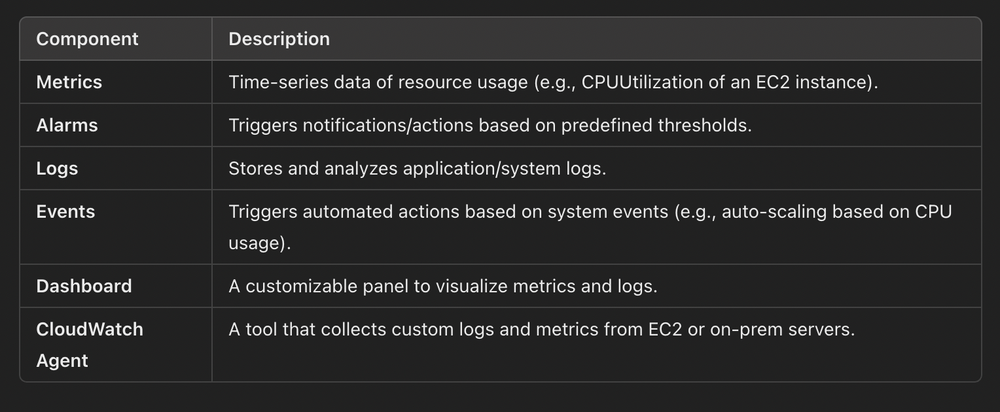

# What is AWS CloudWatch?
- AWS CloudWatch is a monitoring & observability service that helps track metrics, logs, and events from AWS resources and applications
- It enables users to set alarms, visualize operational data, troubleshoot issues, and optimize performance.

# Why is AWS CloudWatch Important?
- Real-time Monitoring: Helps in tracking resource utilization (CPU, Memory, Network, etc.).
- Log Aggregation & Analysis: Collects logs from AWS services and applications.
- Automatic Alarming: Can notify users when a metric crosses a threshold.
- Performance Optimization: Helps analyze trends and optimize resources.
- Troubleshooting & Debugging: Logs and alarms help in identifying system failures.

# Key Components of AWS CloudWatch
  
